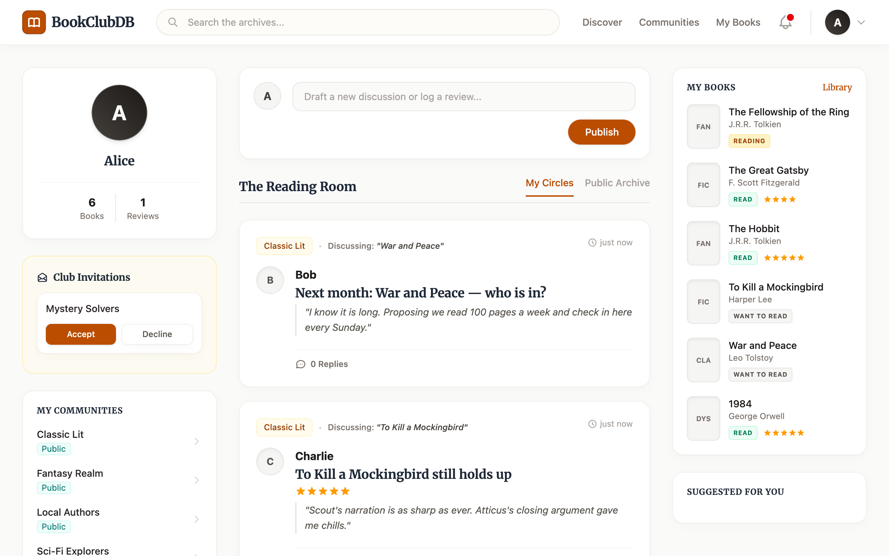
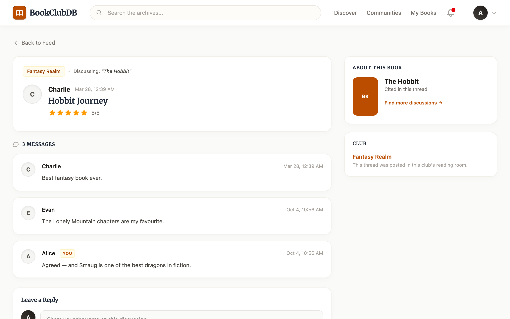
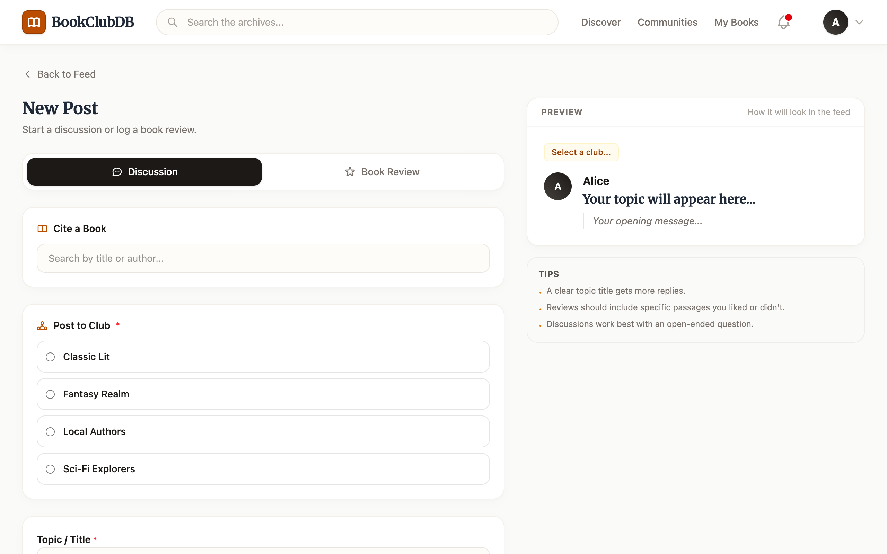
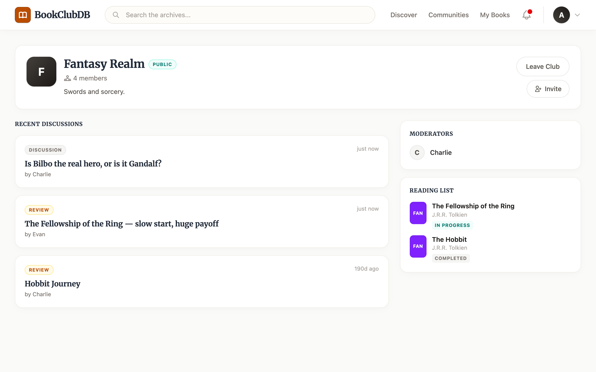
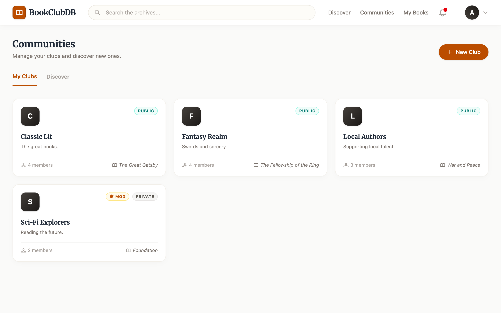
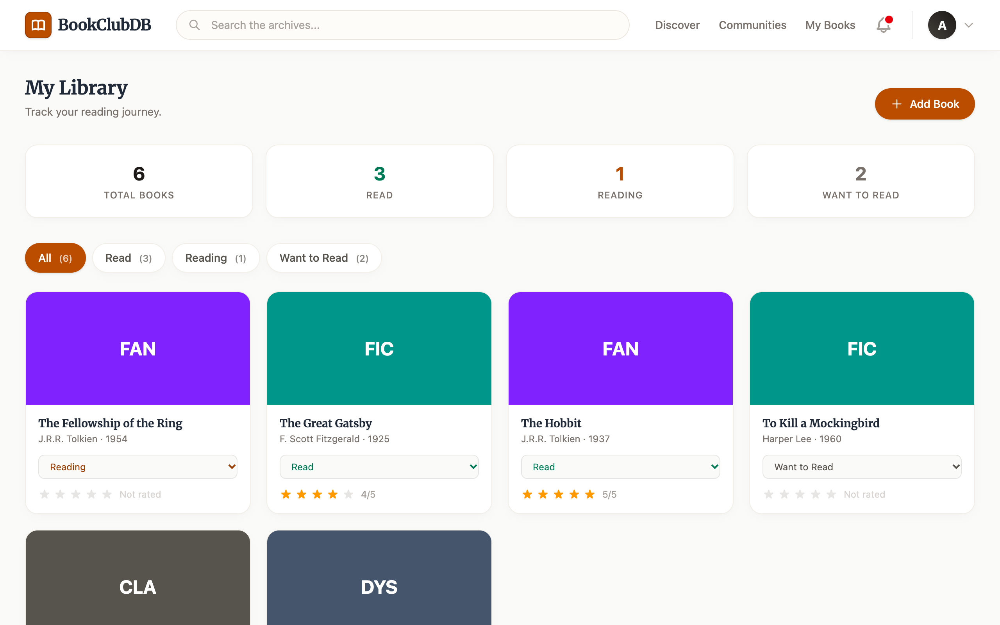
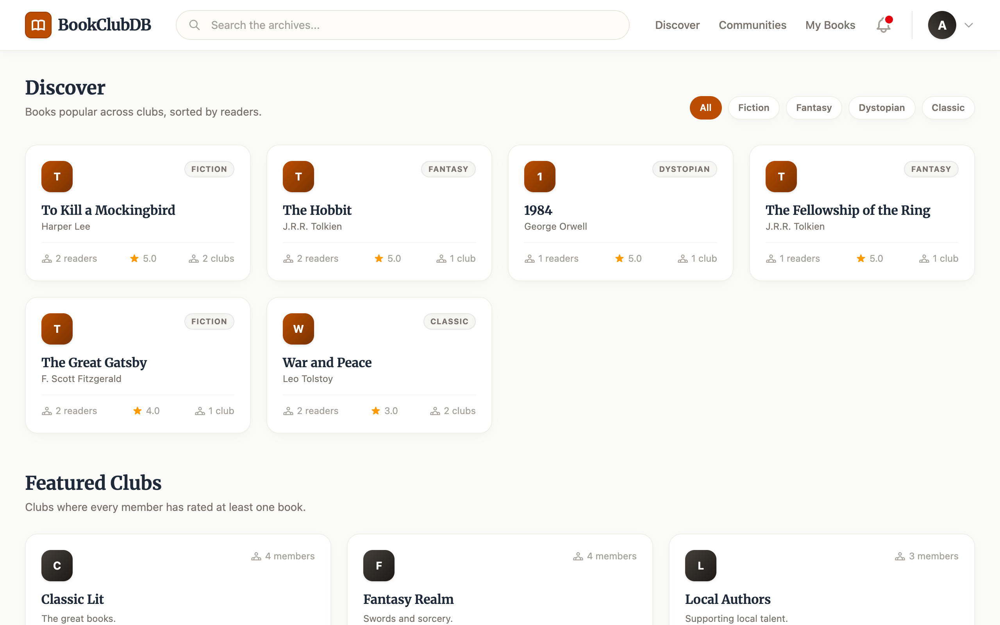
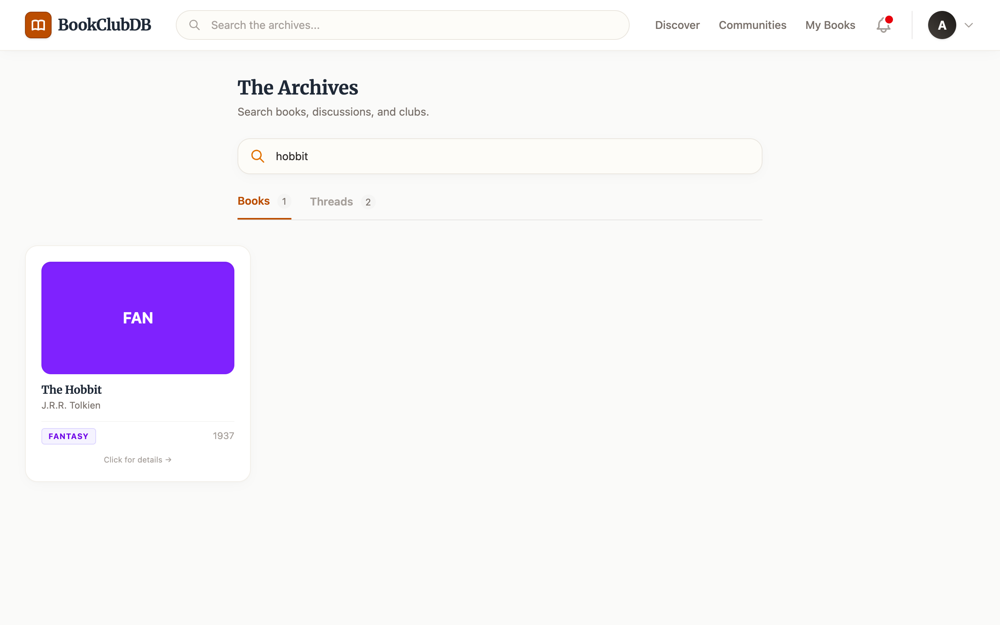
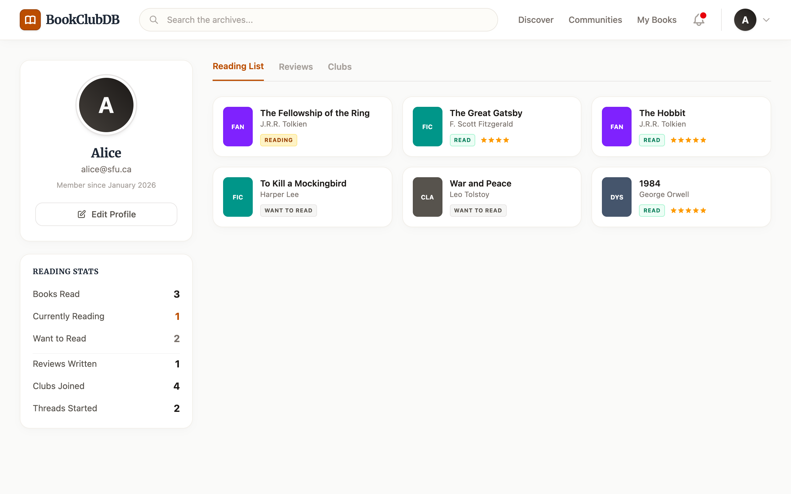
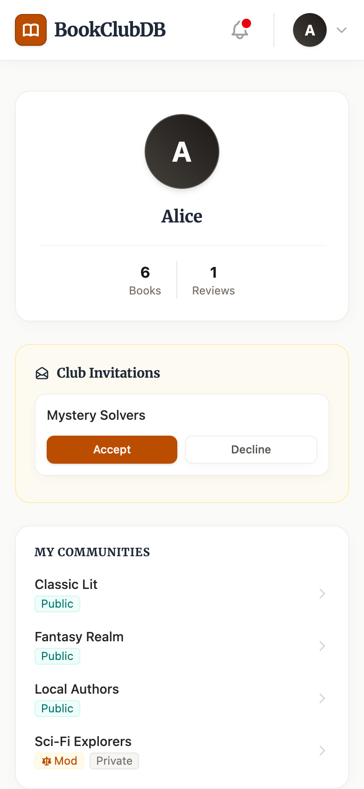

# BookClubDB

An online book club platform built with **MySQL**, **Express**, and **Vue 3**: join or create clubs, discuss books in threads, post star-rated reviews, track a personal reading list, and find new clubs and books.

Built as a team project for **CMPT 354 (Database Systems)**.



---

## Features

### 📰 The Reading Room (home feed)
The home page lists threads from every club you belong to, newest first. A **Public Archive** tab shows threads from public clubs. The sidebars show pending club invitations you can accept inline, your communities, and a snapshot of your reading list.
`FeedView.vue` → `GET /api/feed`, `GET /api/feed/public`

### 💬 Discussions and reviews
Every thread belongs to a club and can cite a book. A thread is either an open **discussion** or a **book review** with a 1–5 star rating. Members reply in order underneath.



The composer has a live preview of how the post will look in the feed. Only clubs you're a member of appear as targets, and the backend enforces the same rule.



`ComposeView.vue` / `ThreadView.vue` → `POST /api/compose/thread`, `POST /api/compose/review`, `POST /api/thread/:id/reply`

### 🏛️ Clubs
Clubs are **public** (anyone can join) or **private** (joined with a passcode). Each club page shows its recent discussions and moderators, plus a shared **reading list** that moderators maintain (Not Started / In Progress / Finished). From a club page you can invite other users by username or email.



The Communities page lists your clubs with member counts, the book each club is currently reading, and badges for clubs you moderate. You can also create a new club here.



`ClubView.vue` / `CommunitiesView.vue` → `/api/club/*`, `/api/communities/*`, `/api/invitations/*`

### 📚 My Library
This is a personal reading list, separate from any club. Mark books *Read*, *Reading*, or *Want to Read*, give them a personal 1–5 rating, and filter by status.



`MyBooksView.vue` → `/api/books/my/*`

### 🔭 Discover
- **Top books:** a leaderboard built from aggregate queries. It counts readers, clubs discussing each book, and the average review rating, and can be filtered by genre.
- **Featured clubs:** clubs in which *every* member has rated at least one book (a relational-division query).



`DiscoverView.vue` → `GET /api/discover/top-books`, `GET /api/discover/clubs`

### 🔍 Search
Search the archives for books (by title, author, or genre) and for discussion threads (by topic, cited book, or author).



### 👤 Profile
Shows account details, reading stats (books read, reviews written, clubs joined, threads started), and tabs for your reading list, reviews, and clubs.



### 📱 Responsive
Layouts reflow down to phone width.

<p align="center"></p>

---

## Database design highlights

The schema is in [`backend/schema/init.sql`](backend/schema/init.sql): **13 tables, 2 triggers**.

- **ISA hierarchy for clubs.** `Club` is specialized into `PublicClub` and `PrivateClub`; only private clubs have a `JoinPasscode` column. Club type is derived from which subtype table holds the row.
- **Weak entity.** `Message` is keyed by `(ThreadID, MessageNum)` and is owned by its `Thread`.
- **Two separate rating systems.** `BookReview.StarRating` is a public, club-facing review attached to a thread. `Rates.Rating` is a private, per-user rating on the reading list.
- **Triggers:**
  - `check_moderator_is_member` (`BEFORE INSERT ON Moderates`) rejects a moderator who isn't a member of the club.
  - `auto_join_on_accept` (`AFTER UPDATE ON Invitation`) adds the user to the club when they accept an invitation.
- **Transactions.** Multi-table writes run in a single transaction, for example:
  - creating a club writes `Club` + subtype + `Joins` + `Moderates` (`backend/routes/communities.js`);
  - posting a review writes `Thread` + first `Message` + `BookReview` (`backend/routes/compose.js`);
  - accepting an invitation is also transactional (`backend/routes/invitations.js`).
- **Parameterized queries everywhere.** All SQL goes through `pool.execute(sql, [params])` placeholders (mysql2).

---

## Tech stack

| Layer | Tech |
|---|---|
| Frontend | Vue 3 (`<script setup>`), Vue Router 4, Vite 7, Tailwind CSS 4 |
| Backend | Node.js, Express 4, express-session, mysql2 (promise API), ES modules |
| Database | MySQL |

---

## Getting started

**Requirements:** Node.js 20.19+ (needed by Vite 7) and a MySQL server.

### 1. Create the database

```bash
mysql -u root -e "CREATE DATABASE BookClubDB"
```

```bash
mysql -u root BookClubDB < backend/schema/init.sql
```

```bash
mysql -u root BookClubDB < backend/schema/seed.sql
```

> ⚠️ `init.sql` drops and recreates every table, so re-running it erases existing data.

### 2. Configure and start the backend

```bash
cp backend/.env.example backend/.env
```

Fill in `backend/.env`. `DB_PORT` is read by `backend/db.js` but isn't in the example file; add it if your server isn't on 3306.

```
DB_HOST=127.0.0.1
DB_PORT=3306
DB_USER=root
DB_PASSWORD=
DB_NAME=BookClubDB
SESSION_SECRET=change-me
PORT=3000
```

```bash
cd backend && npm install && npm start
```

You should see `Database connected` and `Server running on port 3000`.

### 3. Start the frontend

```bash
cd frontend && npm install && npm run dev
```

Open http://localhost:5173. Vite proxies `/api/*` to the backend on port 3000.

### 4. Log in

The seed data creates five demo users (`alice@sfu.ca` … `evan@sfu.ca`). Their passwords are in [`backend/schema/seed.sql`](backend/schema/seed.sql).

---

## Project structure

```
backend/
  app.js                 Express app; mounts 11 routers under /api
  db.js                  mysql2 connection pool
  middleware/
    requireAuth.js       session guard (401 when logged out)
  routes/                auth, search, compose, feed, thread, books,
                         invitations, communities, discover, profile, club
  schema/
    init.sql             schema + triggers
    seed.sql             demo data (5 users, 104 books, 5 clubs, …)
frontend/
  src/
    App.vue              top navigation bar + <RouterView>
    router/index.js      routes + auth navigation guard
    api/                 one fetch wrapper per backend router
    views/               11 pages (Feed, Thread, Compose, Club, …)
```

Further documentation is in [`docs/`](docs/), starting with the [project overview](docs/01-overview.md).

---

## Known limitations

This is a course project, so a few production concerns were out of scope:

- Passwords are stored and compared in plain text. There's no hashing.
- Sessions use express-session's default in-memory store, so they reset whenever the server restarts.
- New IDs come from `MAX(id) + 1` because the tables don't use `AUTO_INCREMENT`.
- There are no automated tests or CI.

---

<sub>Screenshots were taken on a local instance loaded with `seed.sql` plus some extra demo posts, replies, and memberships created through the app's API.</sub>
